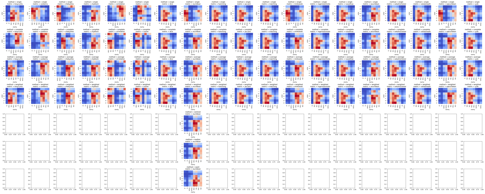

# Seriation

## インポート

``` python
import seaborn as sns
import numpy as np
import pandas as pd
import matplotlib.pyplot as plt
import gc
import os
```

``` python
# 自作関数のインポート

from seriation import save_clustermap_all
```

`sns.clustermap`はデフォルトでは`method="single"`(最近隣法),
`metric="euclidean"`でクラスタリングを行う

## 下三角行列 + ノイズ の行・列をシャッフルしたデータフレーム

下三角行列+ノイズのデータフレームを作成

``` python
size = 15
df_tri = pd.DataFrame(np.tri(size)) * 10 + np.random.randn(size, size)

sns.heatmap(df_tri, cmap="coolwarm")
```

    <AxesSubplot: >


行と列をシャッフル

``` python
df_tri_shufful = df_tri.sample(frac=1.0).T.sample(frac=1.0)
sns.heatmap(df_tri_shufful, cmap="coolwarm")
```

    <AxesSubplot: >


様々な`metric`と`method`の組み合わせで`clustermap`

``` python
path_fig = "./fig/tri.png"
save_clustermap_all(df_tri_shufful, path_fig)
```


``` python
sns.get_dataset_names()
```

    ['anagrams',
     'anscombe',
     'attention',
     'brain_networks',
     'car_crashes',
     'diamonds',
     'dots',
     'dowjones',
     'exercise',
     'flights',
     'fmri',
     'geyser',
     'glue',
     'healthexp',
     'iris',
     'mpg',
     'penguins',
     'planets',
     'seaice',
     'taxis',
     'tips',
     'titanic']

## diamonds

``` python
df_diamonds: pd.DataFrame = sns.load_dataset("diamonds")
df_diamonds.head()
```

<div>
<style scoped>
    .dataframe tbody tr th:only-of-type {
        vertical-align: middle;
    }

    .dataframe tbody tr th {
        vertical-align: top;
    }

    .dataframe thead th {
        text-align: right;
    }
</style>
<table border="1" class="dataframe">
  <thead>
    <tr style="text-align: right;">
      <th></th>
      <th>carat</th>
      <th>cut</th>
      <th>color</th>
      <th>clarity</th>
      <th>depth</th>
      <th>table</th>
      <th>price</th>
      <th>x</th>
      <th>y</th>
      <th>z</th>
    </tr>
  </thead>
  <tbody>
    <tr>
      <th>0</th>
      <td>0.23</td>
      <td>Ideal</td>
      <td>E</td>
      <td>SI2</td>
      <td>61.5</td>
      <td>55.0</td>
      <td>326</td>
      <td>3.95</td>
      <td>3.98</td>
      <td>2.43</td>
    </tr>
    <tr>
      <th>1</th>
      <td>0.21</td>
      <td>Premium</td>
      <td>E</td>
      <td>SI1</td>
      <td>59.8</td>
      <td>61.0</td>
      <td>326</td>
      <td>3.89</td>
      <td>3.84</td>
      <td>2.31</td>
    </tr>
    <tr>
      <th>2</th>
      <td>0.23</td>
      <td>Good</td>
      <td>E</td>
      <td>VS1</td>
      <td>56.9</td>
      <td>65.0</td>
      <td>327</td>
      <td>4.05</td>
      <td>4.07</td>
      <td>2.31</td>
    </tr>
    <tr>
      <th>3</th>
      <td>0.29</td>
      <td>Premium</td>
      <td>I</td>
      <td>VS2</td>
      <td>62.4</td>
      <td>58.0</td>
      <td>334</td>
      <td>4.20</td>
      <td>4.23</td>
      <td>2.63</td>
    </tr>
    <tr>
      <th>4</th>
      <td>0.31</td>
      <td>Good</td>
      <td>J</td>
      <td>SI2</td>
      <td>63.3</td>
      <td>58.0</td>
      <td>335</td>
      <td>4.34</td>
      <td>4.35</td>
      <td>2.75</td>
    </tr>
  </tbody>
</table>
</div>

``` python
df_diamonds.describe(include="all")
```

<div>
<style scoped>
    .dataframe tbody tr th:only-of-type {
        vertical-align: middle;
    }

    .dataframe tbody tr th {
        vertical-align: top;
    }

    .dataframe thead th {
        text-align: right;
    }
</style>
<table border="1" class="dataframe">
  <thead>
    <tr style="text-align: right;">
      <th></th>
      <th>carat</th>
      <th>cut</th>
      <th>color</th>
      <th>clarity</th>
      <th>depth</th>
      <th>table</th>
      <th>price</th>
      <th>x</th>
      <th>y</th>
      <th>z</th>
    </tr>
  </thead>
  <tbody>
    <tr>
      <th>count</th>
      <td>53940.000000</td>
      <td>53940</td>
      <td>53940</td>
      <td>53940</td>
      <td>53940.000000</td>
      <td>53940.000000</td>
      <td>53940.000000</td>
      <td>53940.000000</td>
      <td>53940.000000</td>
      <td>53940.000000</td>
    </tr>
    <tr>
      <th>unique</th>
      <td>NaN</td>
      <td>5</td>
      <td>7</td>
      <td>8</td>
      <td>NaN</td>
      <td>NaN</td>
      <td>NaN</td>
      <td>NaN</td>
      <td>NaN</td>
      <td>NaN</td>
    </tr>
    <tr>
      <th>top</th>
      <td>NaN</td>
      <td>Ideal</td>
      <td>G</td>
      <td>SI1</td>
      <td>NaN</td>
      <td>NaN</td>
      <td>NaN</td>
      <td>NaN</td>
      <td>NaN</td>
      <td>NaN</td>
    </tr>
    <tr>
      <th>freq</th>
      <td>NaN</td>
      <td>21551</td>
      <td>11292</td>
      <td>13065</td>
      <td>NaN</td>
      <td>NaN</td>
      <td>NaN</td>
      <td>NaN</td>
      <td>NaN</td>
      <td>NaN</td>
    </tr>
    <tr>
      <th>mean</th>
      <td>0.797940</td>
      <td>NaN</td>
      <td>NaN</td>
      <td>NaN</td>
      <td>61.749405</td>
      <td>57.457184</td>
      <td>3932.799722</td>
      <td>5.731157</td>
      <td>5.734526</td>
      <td>3.538734</td>
    </tr>
    <tr>
      <th>std</th>
      <td>0.474011</td>
      <td>NaN</td>
      <td>NaN</td>
      <td>NaN</td>
      <td>1.432621</td>
      <td>2.234491</td>
      <td>3989.439738</td>
      <td>1.121761</td>
      <td>1.142135</td>
      <td>0.705699</td>
    </tr>
    <tr>
      <th>min</th>
      <td>0.200000</td>
      <td>NaN</td>
      <td>NaN</td>
      <td>NaN</td>
      <td>43.000000</td>
      <td>43.000000</td>
      <td>326.000000</td>
      <td>0.000000</td>
      <td>0.000000</td>
      <td>0.000000</td>
    </tr>
    <tr>
      <th>25%</th>
      <td>0.400000</td>
      <td>NaN</td>
      <td>NaN</td>
      <td>NaN</td>
      <td>61.000000</td>
      <td>56.000000</td>
      <td>950.000000</td>
      <td>4.710000</td>
      <td>4.720000</td>
      <td>2.910000</td>
    </tr>
    <tr>
      <th>50%</th>
      <td>0.700000</td>
      <td>NaN</td>
      <td>NaN</td>
      <td>NaN</td>
      <td>61.800000</td>
      <td>57.000000</td>
      <td>2401.000000</td>
      <td>5.700000</td>
      <td>5.710000</td>
      <td>3.530000</td>
    </tr>
    <tr>
      <th>75%</th>
      <td>1.040000</td>
      <td>NaN</td>
      <td>NaN</td>
      <td>NaN</td>
      <td>62.500000</td>
      <td>59.000000</td>
      <td>5324.250000</td>
      <td>6.540000</td>
      <td>6.540000</td>
      <td>4.040000</td>
    </tr>
    <tr>
      <th>max</th>
      <td>5.010000</td>
      <td>NaN</td>
      <td>NaN</td>
      <td>NaN</td>
      <td>79.000000</td>
      <td>95.000000</td>
      <td>18823.000000</td>
      <td>10.740000</td>
      <td>58.900000</td>
      <td>31.800000</td>
    </tr>
  </tbody>
</table>
</div>

`color`と`clarity`をクロス集計してヒートマップを作成する

``` python
(
    df_diamonds[["color", "clarity"]]
    .value_counts()
    .unstack()
    .pipe(sns.heatmap, cmap="coolwarm")
)
```

    <AxesSubplot: xlabel='clarity', ylabel='color'>


``` python
(
    df_diamonds[["color", "clarity"]]
    .value_counts()
    .unstack()
    .pipe(sns.clustermap, cmap="coolwarm", figsize=(5, 5))
)
```

    <seaborn.matrix.ClusterGrid at 0x7fb7b46a3c70>


``` python
path_fig = "./fig/diamonds.png"

df_diamonds_crosstab = (
    df_diamonds[["color", "clarity"]]
    .value_counts()
    .unstack()
)
save_clustermap_all(df_diamonds_crosstab, path_fig)
```

    /usr/local/lib/python3.10/dist-packages/seaborn/matrix.py:615: UserWarning: Attempting to set identical low and high xlims makes transformation singular; automatically expanding.
      ax.set_xlim(0, max_dependent_coord * 1.05)
    /usr/local/lib/python3.10/dist-packages/seaborn/matrix.py:623: UserWarning: Attempting to set identical low and high ylims makes transformation singular; automatically expanding.
      ax.set_ylim(0, max_dependent_coord * 1.05)




## iris

``` python
df_iris: pd.DataFrame = sns.load_dataset("iris")
df_iris.head()
```

<div>
<style scoped>
    .dataframe tbody tr th:only-of-type {
        vertical-align: middle;
    }

    .dataframe tbody tr th {
        vertical-align: top;
    }

    .dataframe thead th {
        text-align: right;
    }
</style>
<table border="1" class="dataframe">
  <thead>
    <tr style="text-align: right;">
      <th></th>
      <th>sepal_length</th>
      <th>sepal_width</th>
      <th>petal_length</th>
      <th>petal_width</th>
      <th>species</th>
    </tr>
  </thead>
  <tbody>
    <tr>
      <th>0</th>
      <td>5.1</td>
      <td>3.5</td>
      <td>1.4</td>
      <td>0.2</td>
      <td>setosa</td>
    </tr>
    <tr>
      <th>1</th>
      <td>4.9</td>
      <td>3.0</td>
      <td>1.4</td>
      <td>0.2</td>
      <td>setosa</td>
    </tr>
    <tr>
      <th>2</th>
      <td>4.7</td>
      <td>3.2</td>
      <td>1.3</td>
      <td>0.2</td>
      <td>setosa</td>
    </tr>
    <tr>
      <th>3</th>
      <td>4.6</td>
      <td>3.1</td>
      <td>1.5</td>
      <td>0.2</td>
      <td>setosa</td>
    </tr>
    <tr>
      <th>4</th>
      <td>5.0</td>
      <td>3.6</td>
      <td>1.4</td>
      <td>0.2</td>
      <td>setosa</td>
    </tr>
  </tbody>
</table>
</div>

``` python
df_iris.describe()
```

<div>
<style scoped>
    .dataframe tbody tr th:only-of-type {
        vertical-align: middle;
    }

    .dataframe tbody tr th {
        vertical-align: top;
    }

    .dataframe thead th {
        text-align: right;
    }
</style>
<table border="1" class="dataframe">
  <thead>
    <tr style="text-align: right;">
      <th></th>
      <th>sepal_length</th>
      <th>sepal_width</th>
      <th>petal_length</th>
      <th>petal_width</th>
    </tr>
  </thead>
  <tbody>
    <tr>
      <th>count</th>
      <td>150.000000</td>
      <td>150.000000</td>
      <td>150.000000</td>
      <td>150.000000</td>
    </tr>
    <tr>
      <th>mean</th>
      <td>5.843333</td>
      <td>3.057333</td>
      <td>3.758000</td>
      <td>1.199333</td>
    </tr>
    <tr>
      <th>std</th>
      <td>0.828066</td>
      <td>0.435866</td>
      <td>1.765298</td>
      <td>0.762238</td>
    </tr>
    <tr>
      <th>min</th>
      <td>4.300000</td>
      <td>2.000000</td>
      <td>1.000000</td>
      <td>0.100000</td>
    </tr>
    <tr>
      <th>25%</th>
      <td>5.100000</td>
      <td>2.800000</td>
      <td>1.600000</td>
      <td>0.300000</td>
    </tr>
    <tr>
      <th>50%</th>
      <td>5.800000</td>
      <td>3.000000</td>
      <td>4.350000</td>
      <td>1.300000</td>
    </tr>
    <tr>
      <th>75%</th>
      <td>6.400000</td>
      <td>3.300000</td>
      <td>5.100000</td>
      <td>1.800000</td>
    </tr>
    <tr>
      <th>max</th>
      <td>7.900000</td>
      <td>4.400000</td>
      <td>6.900000</td>
      <td>2.500000</td>
    </tr>
  </tbody>
</table>
</div>

``` python
df_iris_corr = df_iris.select_dtypes("number").corr()
sns.heatmap(df_iris_corr, cmap="coolwarm")
```

    <AxesSubplot: >


``` python
df_iris_corr = df_iris.select_dtypes("number").corr()
sns.clustermap(
    df_iris_corr,
    cmap="coolwarm",
    method="single",
    metric="euclidean",
    figsize=(5, 5),
)
```

    <seaborn.matrix.ClusterGrid at 0x7fb7ac17f130>


``` python
path_fig = "./fig/iris.png"
save_clustermap_all(df_iris_corr, path_fig)
```


## tips

``` python
df_tips: pd.DataFrame = sns.load_dataset("tips")
df_tips.head()
```

<div>
<style scoped>
    .dataframe tbody tr th:only-of-type {
        vertical-align: middle;
    }

    .dataframe tbody tr th {
        vertical-align: top;
    }

    .dataframe thead th {
        text-align: right;
    }
</style>
<table border="1" class="dataframe">
  <thead>
    <tr style="text-align: right;">
      <th></th>
      <th>total_bill</th>
      <th>tip</th>
      <th>sex</th>
      <th>smoker</th>
      <th>day</th>
      <th>time</th>
      <th>size</th>
    </tr>
  </thead>
  <tbody>
    <tr>
      <th>0</th>
      <td>16.99</td>
      <td>1.01</td>
      <td>Female</td>
      <td>No</td>
      <td>Sun</td>
      <td>Dinner</td>
      <td>2</td>
    </tr>
    <tr>
      <th>1</th>
      <td>10.34</td>
      <td>1.66</td>
      <td>Male</td>
      <td>No</td>
      <td>Sun</td>
      <td>Dinner</td>
      <td>3</td>
    </tr>
    <tr>
      <th>2</th>
      <td>21.01</td>
      <td>3.50</td>
      <td>Male</td>
      <td>No</td>
      <td>Sun</td>
      <td>Dinner</td>
      <td>3</td>
    </tr>
    <tr>
      <th>3</th>
      <td>23.68</td>
      <td>3.31</td>
      <td>Male</td>
      <td>No</td>
      <td>Sun</td>
      <td>Dinner</td>
      <td>2</td>
    </tr>
    <tr>
      <th>4</th>
      <td>24.59</td>
      <td>3.61</td>
      <td>Female</td>
      <td>No</td>
      <td>Sun</td>
      <td>Dinner</td>
      <td>4</td>
    </tr>
  </tbody>
</table>
</div>

``` python
df_tips.describe(include="all")
```

<div>
<style scoped>
    .dataframe tbody tr th:only-of-type {
        vertical-align: middle;
    }

    .dataframe tbody tr th {
        vertical-align: top;
    }

    .dataframe thead th {
        text-align: right;
    }
</style>
<table border="1" class="dataframe">
  <thead>
    <tr style="text-align: right;">
      <th></th>
      <th>total_bill</th>
      <th>tip</th>
      <th>sex</th>
      <th>smoker</th>
      <th>day</th>
      <th>time</th>
      <th>size</th>
    </tr>
  </thead>
  <tbody>
    <tr>
      <th>count</th>
      <td>244.000000</td>
      <td>244.000000</td>
      <td>244</td>
      <td>244</td>
      <td>244</td>
      <td>244</td>
      <td>244.000000</td>
    </tr>
    <tr>
      <th>unique</th>
      <td>NaN</td>
      <td>NaN</td>
      <td>2</td>
      <td>2</td>
      <td>4</td>
      <td>2</td>
      <td>NaN</td>
    </tr>
    <tr>
      <th>top</th>
      <td>NaN</td>
      <td>NaN</td>
      <td>Male</td>
      <td>No</td>
      <td>Sat</td>
      <td>Dinner</td>
      <td>NaN</td>
    </tr>
    <tr>
      <th>freq</th>
      <td>NaN</td>
      <td>NaN</td>
      <td>157</td>
      <td>151</td>
      <td>87</td>
      <td>176</td>
      <td>NaN</td>
    </tr>
    <tr>
      <th>mean</th>
      <td>19.785943</td>
      <td>2.998279</td>
      <td>NaN</td>
      <td>NaN</td>
      <td>NaN</td>
      <td>NaN</td>
      <td>2.569672</td>
    </tr>
    <tr>
      <th>std</th>
      <td>8.902412</td>
      <td>1.383638</td>
      <td>NaN</td>
      <td>NaN</td>
      <td>NaN</td>
      <td>NaN</td>
      <td>0.951100</td>
    </tr>
    <tr>
      <th>min</th>
      <td>3.070000</td>
      <td>1.000000</td>
      <td>NaN</td>
      <td>NaN</td>
      <td>NaN</td>
      <td>NaN</td>
      <td>1.000000</td>
    </tr>
    <tr>
      <th>25%</th>
      <td>13.347500</td>
      <td>2.000000</td>
      <td>NaN</td>
      <td>NaN</td>
      <td>NaN</td>
      <td>NaN</td>
      <td>2.000000</td>
    </tr>
    <tr>
      <th>50%</th>
      <td>17.795000</td>
      <td>2.900000</td>
      <td>NaN</td>
      <td>NaN</td>
      <td>NaN</td>
      <td>NaN</td>
      <td>2.000000</td>
    </tr>
    <tr>
      <th>75%</th>
      <td>24.127500</td>
      <td>3.562500</td>
      <td>NaN</td>
      <td>NaN</td>
      <td>NaN</td>
      <td>NaN</td>
      <td>3.000000</td>
    </tr>
    <tr>
      <th>max</th>
      <td>50.810000</td>
      <td>10.000000</td>
      <td>NaN</td>
      <td>NaN</td>
      <td>NaN</td>
      <td>NaN</td>
      <td>6.000000</td>
    </tr>
  </tbody>
</table>
</div>

性別x喫煙者と曜日x時間帯でチップの額をクロス集計したものをヒートマップでみてみる

``` python
(
    df_tips.pivot_table(
        columns=["day", "time"],
        index=["sex", "smoker"],
        values="tip",
        aggfunc="mean",
        fill_value=0,
    ).pipe(sns.heatmap, cmap="coolwarm", annot=True)
)
```

    <AxesSubplot: xlabel='day-time', ylabel='sex-smoker'>


``` python
(
    df_tips.pivot_table(
        columns=["day", "time"],
        index=["sex", "smoker"],
        values="tip",
        aggfunc="mean",
        fill_value=0,
    ).pipe(sns.clustermap, figsize=(5, 5), cmap="coolwarm", annot=True)
)
```

    <seaborn.matrix.ClusterGrid at 0x7fb7ac2125c0>


- 人の属性の軸(sex-smoker)
  - 性別よりも喫煙者か否かのほうが関係が深い
- 時間の軸(day-time)
  - Dinnerはtipが多く、Lunchは少ない傾向にあるが、木曜日はその逆になっている
