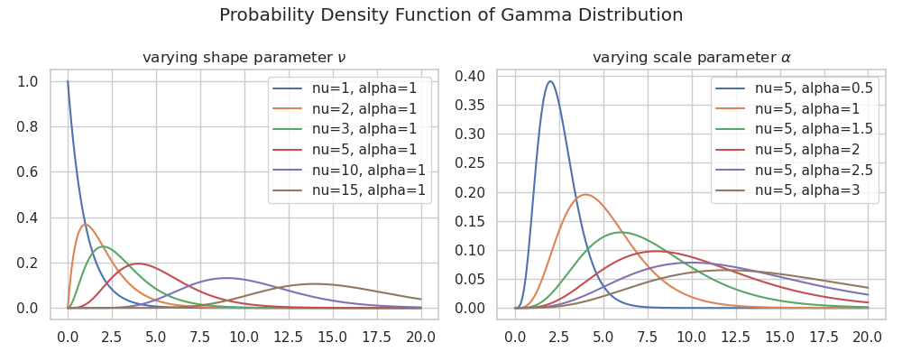

数理統計学
================

## 分布概要

$$
% physicsを使えるようにする
\require{physics}
$$

### — 離散型分布 —

### 2項分布

- 表記: $Bin(n, p)$

- パラメータ

  - 試行回数: $n$
  - 成功確率: $p$

- 確率関数: $$p (k) = \binom{n}{k} p^k (1-p)^{n-k}$$

- 確率母関数: $$G (s) = (1 + p (s - 1))^n$$

- 期待値・分散: $$E \qty [ X] = np, \quad Var \qty [ X ] = np (1 - p)$$

- 再生性:

  $X_1 \sim Bin(n_1, p), X_2 \sim Bin(n_2, p)$ のとき、
  $Y = X_1 + X_2$は$Bin(n_1 + n_2, p)$に従う。

### ポアソン分布

- 表記: $Po(\lambda)$

- パラメータ

  - 平均: $\lambda$

- 確率関数: $$p (k) = \frac{\lambda^{k}}{k!} e^{-\lambda}$$

- 期待値・分散:
  $$E \qty [ X] = \lambda , \quad Var \qty [ X ] = \lambda$$

### 幾何分布

- 意味:

  ベルヌーイ試行の成功確率を $p$ とし、 確率変数 $X$
  を1回成功するまでの失敗の回数とする。 $X$ はパラメータ $p$
  の幾何分布に従う。

- 表記: $Ge(p)$

- パラメータ

  - 成功確率: $p$

- 確率関数: $$p (k) =  p(1-p)^{k}$$

- 確率母関数:
  $$G (s) = \frac{p}{1 - qs} = \qty ( 1 - (s - 1) \frac{q}{p})^{-1}$$

- 期待値・分散:
  $$E \qty [ X] = \frac{1 - p}{p}, \quad Var \qty [ X ] = \frac{1 - p}{p^2}$$

#### 無記憶性

幾何分布は無記憶性を持つ $$
    P(X = x + x_0 | X \geq x_0) = P(X = x)
 \qquad(1)$$

*Proof* (無記憶性を持つことの証明). まず、$P(X \geq x_0)$
を計算する。無限級数の公式より $$
P(X \geq x_0) = \sum_{x = x_0}^{\infty} p(1-p)^{x}
= \frac{p(1 - p)^{x_0}}{1 - (1 - p)} = (1 - p)^{x_0}
$$ となる。 次に [Equation 1](#eq-geometric_distribution_memorylessness)
を確かめる。 [^1]

$$
\begin{aligned}
    P(X = x + x_0 | X \geq x_0) &= \frac{P(X = x + x_0)}{P(X \geq x_0)}  \\
    &= \frac{p(1-p)^{x + x_0}}{(1-p)^{x_0}} \\
    &= p(1-p)^{x} = P(X = x)
\end{aligned}
 \qquad(2)$$

以上から幾何分布が無記憶性を持つことがわかった。

*Proof* (非負整数上の確率分布が無記憶性を持つことの必要十分条件はその確率分布が幾何分布であることの証明). 十分性は上で示したので、必要性を示す。
[Equation 1](#eq-geometric_distribution_memorylessness) が成立するとき、
$$
P(X = x + x_0) = P(X \geq x_0) P(X = x)
$$ となり、とくに $x_0 = 1$ のとき $$
\begin{aligned}
P(X = x + 1) &= P(X \geq 1) P(X = x) \\
&= (1 - P(X = 0)) P(X = 0) \\ 
&= (1 - p) P(X = 0)
\end{aligned}
$$ という漸化式が得られる。ここで $P(X=0) = p$ とおいた。 この漸化式より
$$
P(X = x) = (1 - p) P(X = x - 1) = (1 - p)^{x} P(X = 0) = (1 - p)^{x}p
$$
となり、幾何分布の確率関数になることがわかる。これで必要性が示された。

### 負の2項分布

- 意味:

  ベルヌーイ試行の成功確率を $p$ とし、 確率変数 $X$ を $r$
  回成功するまでの失敗の回数とする。 $X$ は負の2項分布に従う。

- 表記: $NB(r, p)$

- パラメータ

  - 成功回数: $r$
  - 成功確率: $p$

- 確率関数: $$
  \begin{aligned}
  p (k) &= \binom{r + k - 1}{k} p^r (1-p)^{k} \\
  &= {}_{r} H_{k} ~ p^r (1-p)^{k}
  \end{aligned}
  $$

- 確率母関数: $$
  \begin{aligned}
  G (s) &= \qty (\frac{p}{1 - qs})^{r} \\ 
  &= \qty ( 1 - (s - 1) \frac{q}{p})^{-r}
  \end{aligned}
  $$

- 期待値・分散: $$
  E \qty [ X] = \frac{r(1 - p)}{p}, \quad
  Var \qty [ X ] = \frac{r(1 - p)}{p^2}
  $$

- 再生性:

  $X_1 \sim NB(r_1, p), X_2 \sim NB(r_2, p)$ のとき、
  $Y = X_1 + X_2$は$NB(r_1 + r_2, p)$に従う。

#### 確率関数の意味

確率関数に重複組合せ ${}_{r} H_{k}$ が出てくる意味について説明する。  
$r$ 回の成功と $x$ 回の失敗の並び方の場合の数を考える。
最後は成功となることが決まっているので、それぞれの失敗は
はじめ～1回目の成功の間、1回目の成功～2回目の成功の間、・・・、 $r-1$
回目の成功～ $r$ 回目の成功の間
のどこかに位置することになる。この並び方の場合の数は重複組合せ
${}_{r} H_{k}$ となる。

### 超幾何分布

- 表記: $HG(N, M, n)$

- パラメータ

  - くじの総数: $N$
  - あたりの数: $M$
  - くじを引く回数: $n$

- 確率関数: $$
  p (x) = \frac{{}_M C_{x} \times {}_{N-M} C_{n-x}}{{}_{N} C_{n}} , \quad 
    \max \{0, n - (N - M)\} \leq x \leq \min \{n, M\}
  $$

- 確率母関数:

  初等的な関数では表せない

- 期待値・分散: $$
  E \qty [X] = n \frac{M}{N}, \quad 
    Var \qty [ X ] = n \frac{M}{N} \qty (1 - \frac{M}{N}) \times \frac{N - n}{N - 1}
  $$

#### 確率関数の導出

$X = x$ となる確率を求める。 $N$ 個のくじから $n$ 個を引く場合の数は
${}_{N} C_{n}$ である。 このうち、あたりを $x$ 個引く場合の数は、 $M$
個のあたりから $x$ 個をひき、 $N - M$ 個のはずれから $n - x$
個ひく場合の数を考えれば良いので
${}_{M} C_{x} \times {}_{N - M} C_{n - x}$ となる。 よって、求める確率は
$$
P(X = x) = p(x) = \frac{{}_M C_{x} \times {}_{N-M} C_{n-x}}{{}_{N} C_{n}}
$$ となる。$x$ の範囲は以下のように決められる。
${}_M C_x = {}_M C_{M-x}$ であり、 $x \geq 0, M-x \geq$
を満たす必要がある。 つまり $$x \geq 0, \quad M \geq x$$
という条件が得られる。
同様に、${}_{N - M} C_{n - x} = {}_{N - M} C_{N - M - n + x}$ であり、
$n - x \geq 0, N - M - n + x \geq 0$ を満たす必要がある。 つまり $$
x \geq n - (N - M), \quad m \geq x
$$ という条件が得られる。 以上の条件を合わせて $$
\max \{0, n - (N - M)\} \leq x \leq \min \{n, M\}
$$ となる。

### 多項分布

- 確率関数 $$\begin{aligned}
    p(x_1, x_2, \dots, x_k) & = \frac{n!}{x_1! x_2! \dots x_k!} p_1^{x_1} p_2^{x_2} \dots p_k^{x_k}   \\
                            & \qquad (p_1 + p_2 + \dots + p_k = 1, \quad x_1 + x_2 + \dots + x_k = n)
    \end{aligned}$$

### — 連続型分布 —

### 正規分布

- 表記: $N(\mu, \sigma^2)$

- パラメータ

  - 平均: $\mu$
  - 分散: $\sigma^2$

- 密度関数: $$
  f (x) = \frac{1}{\sqrt{2\pi \sigma^2}} \exp \qty ( - \frac{(x - \mu)^2}{2 \sigma^2} )
  $$

- 積率母関数: $$
  \phi(\theta) = \exp \qty ( \mu \theta + \frac{\sigma^2}{2} \theta^2 )
  $$

- 期待値・分散: $$
  E \qty [X] = \mu, \quad Var \qty [ X ] = \sigma^2
  $$

- 再生性:

  $X_1 \sim N(\mu_1, \sigma_1^2), X_2 \sim N(\mu_2, \sigma_2^2)$
  のとき、 $Y = X_1 + X_2$ は
  $N(\mu_1 + \mu_2, \sigma_1^2 + \sigma_2^2)$ に従う。

#### 積率母関数の計算

$$
\begin{aligned}
    \phi(\theta) & = E \qty [e^{\theta X}]                                                                                                                                                                                           \\
    & = \int_{- \infty}^{\infty} \dd{x} e^{\theta x} \frac{1}{\sqrt{2 \pi \sigma^2}} \exp \qty ( - \frac{(x - \mu)^2}{2 \sigma^2} )                                                                                     \\
    & = \int_{- \infty}^{\infty} \dd{x}  \frac{1}{\sqrt{2 \pi \sigma^2}} \exp \qty ( - \frac{(x - \mu)^2}{2 \sigma^2} + \theta x )                                                                                      \\
    & = \int_{- \infty}^{\infty} \dd{x}  \frac{1}{\sqrt{2 \pi \sigma^2}} \exp \qty ( -\frac{1}{2 \sigma^2} \qty (x - (\mu + \sigma^2 \theta))^2 - \frac{-(\mu + \sigma^2 \theta)^2 + \mu^2}{2 \sigma^2} ) & (平方完成)      \\ 
    & = \int_{- \infty}^{\infty} \dd{x}  \frac{1}{\sqrt{2 \pi \sigma^2}} \exp \qty ( -\frac{1}{2 \sigma^2} \qty (x - (\mu + \sigma^2 \theta))^2) \exp \qty ( \mu \theta + \frac{\sigma^2}{2} \theta^2 )                 \\
    & = \exp \qty ( \mu \theta + \frac{\sigma^2}{2} \theta^2 )                                                                                                                                            & (ガウス積分を実行)
\end{aligned}
$$

#### 標本平均と標本分散が独立であること

以下のことを示す

- $\bar{X} = \frac{1}{n} \sum_{i=1}^{n} X_i$ と
  $s^2 = \frac{1}{n - 1} \sum_{i=1}^{n} (X_i - \bar{X})^2$
  が互いに独立である
- $\frac{(n - 1) s^2}{\sigma^2}$ は自由度 $n-1$ のカイ2乗分布に従う

標準正規分布でない場合は標準化したものを考えればよいので、
一般性を失わず、 $X_1, \dots, X_n \sim N(0, 1), i.i.d.$ とする。
ベクトルの形で $\va{X} = (X_1, \dots, X_n)^{T}$ とすると、
$\va{X} \sim N_n(\va{0}, I_n)$ である。

直交行列 $G$ を考える。$G$ の一行目はすべて $\frac{1}{\sqrt{n}}$
であるとする。 他の行は互いに直行するように構成すれば良い。 $\va{Y}$ を
$\va{Y} = G\va{X}$ で定義する。 $G$
は直交行列なので、$\va{Y} \sim N_n(\va{0}, I_n)$ となり、
$Y_1, \dots, Y_n$ は互いに独立となる。 このとき、 $$
\sum_{i=1}^{n} Y_i^2 = \va{Y}^{T} \va{Y}
  = \va{X}^T G^{T} G \va{X} = \va{X}^{T} \va{X} = \sum_{i=1}^{n} X_i^2
$$

また、 $$Y_1 = \frac{1}{\sqrt{n}} \sum_{i=1}^{n} X_i = \sqrt{n}\bar{X}$$
となる。 偏差平方和を計算すると $$
\sum_{i=1}^{n} (X_i - \bar{X})^2 
  = \sum_{i=1}^{n} X_i^2 - 2 \bar{X} \sum_{i=1}^{n} X_i + n \bar{X}^2
  = \sum_{i=1}^{n} Y_i^2 - n \bar{X}^2
  = \sum_{i=1}^{n} Y_i^2 - Y_1^2
  = \sum_{i=2}^{n} Y_i^2
$$ となる。 これは互いに独立な標準正規分布に従う変数の二乗和であるから、
$\sum_{i=2}^{n} Y_i^2 = \frac{(n - 1) s^2}{\sigma^2}$ が自由度 $n-1$
のカイ2乗分布に従うことがわかった。 また、
$s^2 = \frac{1}{n - 1} \sum_{i=1}^{n} (X_i - \bar{X})^2$ が
$Y_2, \dots, Y_n$ のみに依存し、 $Y_1 = \sqrt{n} \bar{X}$
に依存しないことから $s^2$ と $\bar{X}$ が独立であることがわかった。

### 多変量正規分布

- 表記: $N_n(\va{\mu}, \Sigma)$

- パラメータ:

  - 平均ベクトル: $\va{\mu}$
  - 分散共分散行列: $\Sigma$

- 密度関数: $$
  f (\va{x}) 
  = \frac{1}{\sqrt{2\pi}^n \sqrt{|\Sigma|}} 
  \exp \qty ( - \frac{1}{2} (\va{x} - \va{\mu})^{T} \Sigma^{-1} (\va{x} - \va{\mu}) )
  $$

- 積率母関数: $$
  \phi(\va{\theta}) 
  = \exp \qty ( \va{\mu}^{T} \va{\theta} + \frac{1}{2} \va{\theta}^{T} \Sigma \va{\theta} )
  $$

- 期待値・分散: $$
  E \qty [\va{X}] = \va{\mu}, \quad Var \qty [ \va{X} ] = \Sigma
  $$

- 再生性:

  $\va{X}_1 \sim N(\va{\mu}_1, \Sigma_1), \va{X}_2 \sim N(\va{\mu}_2, \Sigma_2)$
  のとき、
  $\va{Y} = \va{X}_1 + \va{X}_2$は$N(\va{\mu}_1 + \va{\mu}_2, \Sigma_1 + \Sigma_2)$
  に従う。

#### 精度行列

#### 線形変換

#### 周辺分布

#### 条件付き分布

### カイ2乗分布

- 定義:

  $Z_i \sim N(0, 1), i = 1, \dots, n$ で、これらが互いに独立なとき
  $Y = Z_1^2 + \dots + Z_n^2$ が従う分布を自由度 $n$
  のカイ2乗分布という。

- 表記: $\chi^2(n)$

- パラメータ

  - 自由度: $n$

- 密度関数: $$
  f (x) = \frac{1}{\Gamma(\frac{n}{2}) 2^{\frac{n}{2}}}
    y^{\frac{n}{2} - 1} e^{- \frac{y}{2}}, \quad (y > 0)
  $$

- 積率母関数: $$\phi(\theta) =$$

- 期待値・分散: $$
  E \qty [X] = n, \quad Var \qty [ X ] = 2n
  $$

- 再生性:

  $X_1 \sim \chi^2(n_1), X_2 \sim \chi^2(n_2)$ のとき、 $Y = X_1 + X_2$
  は $\chi^2(n_1 + n_2)$ に従う。

### $F$ 分布

- 定義:

  $X_1 \sim \chi^2(n_1), X_2 \sim \chi^2(n_2)$
  でこれらが互いに独立なとき、 $$
    \frac{X_1/n_1}{X_2/n_2}
    $$

  が従う分布を自由度 $(n_1, n_2)$ の $F$ 分布という。

- 表記: $F(n_1, n_2)$

- パラメータ:

  - 自由度: $(n_1, n_2)$

- 密度関数: $$
  f (x) =
  $$

- 積率母関数: $$
  \phi(\theta) =
  $$

- 期待値・分散: $$
  E \qty [X] = , \quad Var \qty [ X ] =
  $$

### $t$ 分布

$Z \sim N(0, 1), Y \sim \chi^2(n)$ で、これらが互いに独立なとき、
$$T = \frac{Z}{\sqrt{Y/n}}$$ が従う分布を自由度$n$の$t$分布という。

$$t(n)$$

$n$

$$f (x) = \frac{\Gamma(\frac{n+1}{2})}{\sqrt{\pi n}\Gamma{\frac{n}{2}}}
    \qty ( 1 + \frac{t^2}{n} )^{- \frac{n+1}{2}}$$

$$\phi(\theta) =$$

$$E \qty [X] = 0 \quad (n > 1), \quad Var \qty [ X ] = \frac{n}{n - 2} \quad (n > 2)$$

### 指数分布

$$Ex(\lambda)$$

$\lambda > 0$

$$f(x) = \lambda e^{- \lambda x}, \quad x > 0$$

$$\phi (\theta) = \frac{\lambda}{\lambda - \theta}$$

$$E \qty [ X] = \frac{1}{\lambda}, \quad Var \qty [ X ] = \frac{1}{\lambda^2}$$

#### 無記憶性

指数分布は無記憶性を持つ
$$\label{eq:exponential_distribution_memorylessness}
  P(T = t + t_0 | T \geq t_0) = P(T = t)$$

##### 無記憶性を持つことの証明

$T \sim Ex(\lambda)$とする。
$T$の確率密度関数は$f(t) = \lambda e^{-\lambda t}$である。
$T > t_0$が与えられたときの$T$の条件付き確率密度関数を求める。
$$\begin{aligned}
    f_{T | T > t_0} (t) \dd{t} &= P( t \leq T \leq t + \dd{t} | T > t_0) \\
    &= \frac{P( t \leq T \leq t + \dd{t} , T > t_0)}{P(T > t_0)}  \\
    &= \frac{P( t \leq T \leq t + \dd{t} , t > t_0)}{\int_{t_0}^{\infty}\dd{t}f(t)} \\
    &= \frac{f(t)\dd{t} \times I_{[t>t_0]}(t)}{e^{-\lambda t_0}} \\
    &= \lambda e^{-\lambda (t - t_0)} I_{[t>t_0]}(t) \dd{t}
  \end{aligned}$$ であるから、
$$f_{T | T > t_0} (t) =  \lambda e^{-\lambda (t - t_0)}  \quad (t > t_0)$$
となる。
これは基準点を$t_0$にずらした変数$\tilde{T} = T - t_0$の確率密度関数と等しくなる。
指数分布が無記憶性を持つことがわかった。

##### 正の実数上の確率分布が無記憶性を持つことの必要十分条件はその確率分布が指数分布であることの証明

十分性は上で示したので、必要性を示す。
<a href="#eq:exponential_distribution_memorylessness"
data-reference-type="ref"
data-reference="eq:exponential_distribution_memorylessness">[eq:exponential_distribution_memorylessness]</a>が成り立つとき、
$$f(t + t_0) = (1 - F(t_0)) f(t) = f(t) - F(t_0) f(t)$$
となる。ここで$t_0 = \Delta t$と書き、$\Delta t$が小さい時を考える。
すると $$\frac{f(t + \Delta t) - f(t)}{\Delta t} =
   - \frac{1}{\Delta t} \qty ( \int_{0}^{\Delta t} \dd{t} f(t)) f(t)$$
と書くことができ、$\Delta t \rightarrow 0$で上式は
$$f'(t) = - f(0) f(t)$$
という微分方程式が得られる。$f(0)$は定数であるので、$f(0)=\lambda$とおく。
この微分方程式を解くと $$f(t) = \lambda e^{- \lambda t}$$
となる。ここで全体にかかる係数$\lambda$は上で決めた$f(0)=\lambda$から定まる。
これは指数分布の密度関数である。これで必要性が示された。

### ガンマ分布

<figure>

<figcaption aria-hidden="true">ガンマ分布の密度関数</figcaption>
</figure>

$$Ga(\nu, \alpha)$$

$\nu > 0$ $\alpha > 0$

$$f(x) = \frac{1}{\alpha^{\nu} \Gamma (\nu)} x ^ {\nu - 1} e ^ {- \frac{x}{\alpha}}, \quad x >0$$

$$\phi (\theta) = ( 1 - \theta \alpha) ^ {- \nu}$$

$$E \qty [ X] = \nu \alpha, \quad Var \qty [ X ] = \nu \alpha ^2$$

$X_1 \sim Ga(\nu_1, \alpha), X_2 \sim Ga(\nu_2, \alpha)$ のとき、
$Y = X_1 + X_2$は$Ga(\nu_1 + \nu_2, \alpha)$に従う。

#### 期待値・分散の計算

$X \sim Ga(\nu, 1)$とする。

$X$の期待値 $$\begin{aligned}
    E \qty [X] & = \int_0^{\infty} \frac{x}{\Gamma(\nu)} x^{\nu - 1} e^{-x} \dd{x}
    = \frac{1}{\Gamma(\nu)} \int_0^{\infty}  x^{(\nu + 1) - 1} e^{-x} \dd{x}       \\
               & = \frac{\Gamma(\nu + 1)}{\Gamma(\nu)}
    = \frac{\nu !}{(\nu - 1)!}                                                     \\
               & = \nu
  \end{aligned}$$

$X^2$の期待値 $$\begin{aligned}
    E \qty [X^2] & = \int_0^{\infty} \frac{x^2}{\Gamma(\nu)} x^{\nu - 1} e^{-x} \dd{x}
    = \frac{1}{\Gamma(\nu)} \int_0^{\infty}  x^{(\nu + 2) - 1} e^{-x} \dd{x}           \\
                 & = \frac{\Gamma(\nu + 2)}{\Gamma(\nu)}
    = \frac{(\nu + 1)!}{(\nu - 1)!}                                                    \\
                 & = (\nu + 1)\nu
  \end{aligned}$$

$X$の分散
$$Var \qty [X] = E \qty [X^2] - (E \qty [X])^2 = (\nu + 1)\nu - \nu^2 = \nu$$

$Y = \alpha X$とすると、$Y \sim Ga(\nu, \alpha)$となる。

$Y$の期待値 $$E \qty [Y] = E \qty [\alpha X] = \alpha \nu$$

$Y$の分散 $$Var \qty [Y] = Var \qty [\alpha X] = \alpha^2 \nu$$

### ベータ分布

$X \sim Be(\alpha, \beta)$のとき、$1 - X \sim Be(\beta, \alpha)$

## 分布の間の関係

### ガンマ分布とカイ2乗分布

$Ga(\frac{n}{2}, 2)$は自由度$n$のカイ2乗分布になる

### ガンマ分布と指数分布

$Ga(1, \frac{1}{\lambda})$はパラメータ$\lambda$の指数分布$Ex(\lambda)$になる

### ガンマ分布と負の二項分布

ガンマ分布は負の2項分布を連続変数化したものと考えられる

ポアソン分布に従うイベントが$\nu$回起こるまでの時間。
ポアソン分布に従うイベントが1回起こるまでの時間。

ベルヌーイ試行が$r$回成功するまでの失敗の回数。
ベルヌーイ試行が1回成功するまでの失敗の回数。

### 二項分布とポアソン分布

$$\begin{aligned}
    p(x) &= \binom{n}{x} p^{x} (1 - p)^{n -x} \\
    &= \frac{n!}{x! (n - x)!} \qty (\frac{\lambda}{n})^{x} \qty (1 - \frac{\lambda}{n})^{n - x}  & (\lambda = np) \\
    &= \frac{1}{x!} n \cdot (n - 1) \cdot \dots \cdot (n - x + 1) \qty (\frac{\lambda}{n})^{x} \qty (1 - \frac{\lambda}{n})^{n - x} \\
    &= \frac{1}{x!} 1 \cdot \qty(1 - \frac{1}{n}) \cdot \dots \cdot \qty (1 - \frac{x - 1}{n})
    \lambda^{x} \qty (1 - \frac{\lambda}{n})^{n}  \qty (1 - \frac{\lambda}{n})^{-x} \\
    &= \frac{1}{x!} 1 \cdot \qty(1 - \frac{1}{n}) \cdot \dots \cdot \qty (1 - \frac{x - 1}{n})
    \lambda^{x} \qty { \qty (1 - \frac{\lambda}{n})^{-\frac{n}{\lambda}} }^{- \lambda} \qty (1 - \frac{\lambda}{n})^{-x} \\
    &\rightarrow \frac{\lambda^x}{x!}e^{-\lambda} & (n \rightarrow \infty)
  \end{aligned}$$

### 指数分布とポアソン分布

#### ポアソン分布から指数分布を導く

単位時間あたり平均で$\lambda$回ランダムに発生するイベントが
時間$(0, t)$の間に発生する回数は$Po(\lambda t)$に従う。
$X \sim Po(\lambda t)$とする。$X$の確率関数は
$$p(x) = \frac{(\lambda t)^x}{x!}e^{-\lambda t}$$ である。
イベントが1回発生するまでの時間を表す確率変数を$T$とする。
$T$の分布関数は $$\begin{aligned}
    F(t) &= P(T \leq t) \\
    &= 1 - P(T > t) \\
    &= 1 - (時間(0, t)内に一回もイベントが発生しない確率) \\
    &= 1 - P(X = 0) \\
    &= 1 - p(x=0) \\
    &= 1 - e^{-\lambda t}
  \end{aligned}$$ となり、これは指数分布の分布関数である。
密度関数を計算すると $$f(t) = \dv{t} F(t) = \lambda e^{- \lambda t}$$
となる。

#### 指数分布からポアソン分布を導く

$T_i$をイベントが発生するまでの時間を表す確率変数とし、$T_i \sim Ex(\lambda)$とする。
$$U_k = \sum_{i=1}^{k} T_i$$ とし、$X$を
$$X = (U_k < t を満たす最大のk)$$
と定義する。つまり$X$は時刻$t$までに発生したイベントの回数を表す確率変数である。
$X=k$となる確率を求めると $$\begin{aligned}
    P(X = k) &= (k回目のイベントが時刻(0, t)の間に発生し、k+1回目のイベントは時刻tより後に発生する確率) \\
    &= \int_{0}^{t} P(U_k = s, U_{k+1} > t) \dd{s} 
    = \int_{0}^{t} P(U_k = s) P(U_{k+1} > t | U_k = s) \dd{s} \\
    &= \int_{0}^{t} P(U_k = s) P(T_{k+1} > t-s) \dd{s} 
    = \int_{0}^{t} \frac{\lambda^k}{\Gamma(k)} s^{k-1} e^{-\lambda t} 
    e^{- \lambda (t-s)} \dd{s}  \\
    &= \frac{\lambda^k}{(k -1)!} e^{-\lambda t} \int_{0}^{t} s^{k-1} \dd{s} 
    = \frac{\lambda^k}{(k -1)!}e^{-\lambda t} \frac{1}{k} t^{k} \\
    &= \frac{(\lambda t)^k}{k!}e^{-\lambda t}
  \end{aligned}$$ となり、これは$Po(\lambda t)$の確率関数である。
途中で$U_k \sim Ga(k, 1/\lambda)$であることを使った。

### 指数分布と幾何分布

$T$をイベントが発生するまでの時間を表す確率変数とし、$T \sim Ex(\lambda)$とする。
時間を間隔$d$で離散化する。
離散化した各時間の中で初めてイベントが発生する確率は $$\begin{aligned}
  &時間(0, d]の間に初めてイベントが発生する確率 &&= P(T \leq d) = 1 - e^{- \lambda d} \\
  &時間(d, 2d]の間に初めてイベントが発生する確率 = P(T \leq 2d | T > d) &&= P(T \leq d) = 1 - e^{- \lambda d} \\
  &時間(2d, 3d]の間に初めてイベントが発生する確率 = P(T \leq 3d | T > 2d) &&= P(T \leq d) = 1 - e^{- \lambda d} \\
  & &&\vdots
\end{aligned}$$ となる。ここで指数分布の無記憶性を使った。
つまり各時間間隔$d$のなかで初めてイベントが発生する確率は常に等しく
$p = 1 - e^{-\lambda d}$となる。

$x$を整数とする。時刻$xd$までイベントが発生せず、
時間$(xd, (x+1)d]$の間に初めてイベントが起こったとき$X=x$となるように確率変数$X$を定める。
このとき、$X$はパラメータ$p = 1 - e^{-\lambda d}$の幾何分布$Ge(p)$に従う。

## 十分統計量

### 概要

#### 十分統計量の定義

$k$個の統計量$T = ( T_1, \dots, T_k )$がパラメータ$\theta$に関する$k$次元の十分統計量であるとは、
$T$を与えられたとき$X = ( X_1, \dots, X_n )$の条件付き分布が$\theta$に依存しないことである。
$$\label{eq:sufficient_statistic_definition}
  P(X | T, \theta) = P(X | T)$$

ベイズ統計のように$\theta$を確率変数として考えれば、<a href="#eq:sufficient_statistic_definition" data-reference-type="ref"
data-reference="eq:sufficient_statistic_definition">[eq:sufficient_statistic_definition]</a>は、
$T$を与えたときに$X$と$\theta$が条件付き独立となることを意味する。
$X$と$\theta$が条件付き独立ということは、$T$さえ知っていればそれ以上$X$から$\theta$の情報が得られないということ。
つまり$T$だけ知っていれば$X$から得られる$\theta$に関する情報はすべてわかるということ。

#### 分解定理

$X$を離散確率変数または連続確率変数とし$p_\theta$を$X$の確率関数または密度関数とする。
$T(X) = ( T_1(X), \dots, T_k(X))$が十分統計量であるための必要十分条件は$p_\theta$が
$$p_\theta (x) = g_\theta (T(x)) h(x)$$

の形に分解できることである。ここで$h(x)$は$\theta$を含まない$x$のみの関数である。

#### ラオ・ブラックウェルの定理

$\delta(X)$を未知パラメータ$\theta$の推定量とし、
平均二乗誤差$R(\theta, \delta) = E_{\theta} \qty [(\delta(X) - \theta)^2]$をリスク関数とする。
ここで、十分統計量$T$を与えたときの$X$の条件付き分布を用いて$\delta(X)$の条件付き期待値をとったものを$\delta^{*}(T)$とする。
すなわち $$\delta^{*}(T) = E \qty [ \delta(X) | T ]$$
である。このとき次のことが成り立つ。
$$E_{\theta} \qty [(\delta^{*}(T) - \theta)^2] \leq E_{\theta} \qty [(\delta(X) - \theta)^2], \quad \forall \theta$$
であり、等号が成立するのは$P_{\theta}(\delta(X) = \delta^{*}(T)) = 1$となるときのみである。
[^2]

#### 完備性の定義

統計量$T(X)$が完備であるとは、$T$の関数$g(T)$のなかで恒等的にその期待値が0となるものは、
定数0に限るということである。 すなわち、任意の関数$g(T)$に対し
$$E_{\theta} \qty [g(T)] = 0, \quad \forall \theta \Rightarrow g(T) \equiv 0$$
が成り立つならば$T$は完備である。 [^3]

### ポアソン分布

##### 十分統計量の計算

$X_1, \dots, X_n \sim Po(\lambda), i.i.d.$とする。確率関数は
$$p_\lambda(x) = \prod_{i=1}^{n} \frac{\lambda^{x_i}}{x_i !} e^{- \lambda}
  = \lambda ^{\sum_{i=1}^{n} x_i} e^{-n \lambda} \qty ( \prod_{i=1}^{n} x_i ! ) ^{-1}$$
と表される。ここで
$$g_\lambda = \lambda ^{\sum_{i=1}^{n} x_i} e^{-n \lambda}, \quad h(x) = \qty ( \prod_{i=1}^{n} x_i ! ) ^{-1}$$
とおけば、$T = \sum_{i=1}^{n}X_i$が十分統計量であることがわかる。

### 正規分布

##### 一次元の十分統計量の計算

$X_1, \dots, X_n \sim N(\mu, 1), i.i.d.$とする。$X$の同時密度関数は
$$\begin{aligned}
    f(x) & = \frac{1}{(2\pi)^{n/2}} \exp \qty [ - \frac{1}{2} \sum_{i=1}^{n} (x_i - \mu)^2 ]                                                                                                      \\
         & = \frac{1}{(2\pi)^{n/2}} \exp \qty [ - \frac{1}{2} \sum_{i=1}^{n} (x_i - \bar{x} + \bar{x} - \mu)^2 ]                                                                                  \\
         & = \frac{1}{(2\pi)^{n/2}} \exp \qty [ - \frac{1}{2} \sum_{i=1}^{n} (x_i - \bar{x})^2  - \sum_{i=1}^{n} (x_i - \bar{x})(\bar{x} - \mu)  - \frac{1}{2} \sum_{i=1}^{n} (\bar{x} - \mu)^2 ] \\
         & = \frac{1}{(2\pi)^{n/2}} \exp \qty [ - \frac{1}{2} \sum_{i=1}^{n} (x_i - \bar{x})^2 - \frac{n (\bar{x} - \mu)^2}{2} ]
  \end{aligned}$$ と表すことができる。したがって、
$$g_\mu = \frac{1}{(2\pi)^{n/2}} \exp \qty (- \frac{n (\bar{x} - \mu)^2}{2}), \quad
  h(x) = \exp \qty (- \frac{1}{2} \sum_{i=1}^{n} (x_i - \bar{x})^2)$$
とおけば、分解定理より$\bar{X}$が十分統計量であることがわかる。

### 一様分布

##### 一次元の十分統計量の計算

$X_1, ..., X_n \sim U[0, \theta]$とする。同時密度関数は
$$\label{eq:uniform_pdf}
  f_\theta (x) = 
  \begin{dcases}
    \frac{1}{\theta^{n}}, & \text{ if } 0 \leq x_i \leq \theta, \forall i \\
    0,                    & \text{otherwise}
  \end{dcases}$$
と表される。ここで、$X_{max} = \max_{i} X_i$とし、以下の関数を定義する。
$$I _{[x_{max} \leq \theta]}(x) =
  \begin{dcases}
    1, & \text{ if } x_{max} \leq \theta \\
    0, & \text{ otherwise}
  \end{dcases}$$

$$h(x) = h(x_1, \dots, x_n) = 
  \begin{dcases}
    1, & \text{ if } x_i \geq 0, \forall i \\
    0, & \text{ otherwise }
  \end{dcases}$$

$x_i \geq 0, \forall i \Leftrightarrow x_{max} \leq \theta$であることに注意すれば、<a href="#eq:uniform_pdf" data-reference-type="ref"
data-reference="eq:uniform_pdf">[eq:uniform_pdf]</a>は
$$f_{\theta} (x) = \frac{1}{\theta^n} I _{[x_{max} \leq \theta]}(x) h(x)$$
と書ける。したがって、
$$g_{\theta} = \frac{1}{\theta^n} I _{[x_{max} \leq \theta]}(x)$$
とおけば、分解定理より$T(X) = X_{max}$が十分統計量であることがわかる。

## 不偏推定量

### 概要

#### 不偏推定量の定義

$\hat{\theta}$が不偏推定量であるとは、
$$E_{\theta} \qty [\hat(\theta)(X)] = \theta, \quad \forall \theta$$
が成り立つことである。

#### 一様最小分散不偏推定量(Uniformly Minimum Variance Unbiased estimator, UMVU)の定義

$\hat{\theta}$が不偏推定量であれば平均二乗誤差は分散に一致する。
$$E_{\theta} \qty [( \hat{\theta} - \theta )] = E_{\theta} \qty [( \hat{\theta} - E_{\theta}[\hat{\theta}] )] = Var_{\theta} \qty [\hat{\theta}]$$
したがって、不偏推定量に限れば、分散を最小にする推定量が望ましい推定量となる。

不偏推定量$\hat{\theta}^{*}$がUMVUであるとは、任意の不偏推定量$\hat{\theta}$について
$$Var_{\theta} \qty [\hat{\theta}^{*}] \leq Var_{\theta} \qty [\hat{\theta}], \quad \forall \theta$$
が成り立つことである。

与えられた不偏推定量がUMVUであることを示す方法
フィッシャー情報量に基づくクラメル・ラオの不等式を用いる方法
完備十分統計量の理論を用いる方法

#### フィッシャー情報量

$X = (X_1, \dots, X_n)$の同時密度関数あるいは同時確率関数を$f(x, \theta)$で表す。
ここで、$\theta$は1次元のパラメータとする。
このとき$\theta$に関するフィッシャー情報量$I_n(\theta)$は次式で定義される。
$$\begin{aligned}
    I_n(\theta) & = E_{\theta} \qty [\qty (\pdv{\log f(x, \theta)}{\theta})^2]                        \\
                & = \int \qty (\frac{\pdv{\theta} f(x, \theta)}{f(x, \theta)}) ^2 f(x, \theta) \dd{x} \\
                & = \int \frac{\qty (\pdv{\theta} f(x, \theta))^2}{f(x, \theta)} \dd{x}
  \end{aligned}$$

$X_1, \dots, X_n$が独立同一分布に従うときには
$$I_n(\theta) = nI_1(\theta)$$ となる。

#### クラメル・ラオの不等式

不偏推定量の分散とフィッシャー情報量の間には次の不等式が成立する。
$\hat{\theta}$を$\theta$の不偏推定量とする。このとき
$$Var_{\theta} \qty [\hat{\theta}] \geq \frac{1}{I_n(\theta)}$$

#### 不偏推定量がUMVUであることを示す

##### フィッシャー情報量に基づくクラメル・ラオの不等式を用いる方法

不偏推定量$\hat{\theta}^{*}$が
$$Var_{\theta} \qty [\hat{\theta}^{*}] = \frac{1}{I_n(\theta)}, \quad \forall \theta$$
を満たせば、$\hat{\theta}^{*}$はUMVUである。

##### 完備十分統計量の理論を用いる方法

$T$を完備十分統計量とする。このとき$T$の関数である不偏推定量$\delta^{*}(T)$は一意的に定まり
$\delta^{*}(T)$はUMVUとなる。
また、任意の不偏推定量を$\hat{\theta}$とするとき
$E[\hat{\theta} | T]$は$\delta^{*}(T)$に一致する。

以上のことは次のように確かめられる。
$\hat{\theta}$を不偏推定量とし、$T(X)$を（一般の）十分統計量とする。
$$\hat{\theta}^{*}(t) = E \qty [\hat{\theta}(X) | T(X) = t]$$
とおくと、期待値の繰り返しの公式により、
$$\theta = E_{\theta} \qty [\hat{\theta}(X)] = E_{\theta}^{T} \qty [E [\hat{\theta}|T]] = E_{\theta}^{T} \qty [\hat{\theta}^{*}(T)]$$
となるから、$\hat{\theta}^{*}(T)$も不偏推定量であることがわかる。
そしてラオ・ブラックウェルの定理により、$\hat{\theta}^{*}(T)$と$\hat{\theta}$が一致しない限り
$Var_{\theta} \qty [\hat{\theta}^{*}(T)] < Var_{\theta} \qty [\hat{\theta}]$
となる。 [^4]

次に、$T$を完備十分統計量とする。同様に
$$\hat{\theta}^{*}(t) = E \qty [\hat{\theta}(X) | T(X) = t]$$ とおく。
ここで、$\tilde{\theta}$をほかの任意の不偏推定量とする。
$\tilde{\theta}$にラオ・ブラックウェルの定理を応用して
$$\tilde{\theta}^{*}(t) = E \qty [\tilde{\theta}(X) | T(X) = t]$$
とおく。
このとき、$Var_{\theta} [\tilde{\theta}] \geq Var_{\theta} [\tilde{\theta}^{*}]$である。
ところで、$g(T) = \hat{\theta}^{*}(T) - \tilde{\theta}^{*}(T)$とおくと、
$$E_{\theta} \qty [g(T)] = E_{\theta} \qty [\hat{\theta}^{*}(T) - \tilde{\theta}^{*}(T)] = \theta - \theta = 0, \quad \forall \theta$$
となる。したがって完備性の定義より$g(T) \equiv 0$すなわち$\hat{\theta}^{*}(T) \equiv \tilde{\theta}^{*}(T)$でなければならない。
このとき、$Var_{\theta} \qty [\tilde{\theta}^{*}] = Var_{\theta} \qty [\hat{\theta}^{*}]$となるから、
$Var_{\theta} \qty [\tilde{\theta}] \geq Var_{\theta} \qty [\hat{\theta}^{*}]$となることが示された。
[^5]

## 最尤推定量

### 多項分布

対数尤度関数は
$$l(p_1, p_2, \dots, p_k) = x_1 \log p_1 + x_2 \log p_2 + \dots x_k \log p_k + const.$$

これを、$p_1 + p_2 + \dots + p_k = 1$の条件の下で最大化する$p_i$を見つける。
Lagrangeの未定乗数$\lambda$を用いて、関数
$$\tilde{l}(p_1, p_2, \dots, p_k, \lambda)
  = x_1 \log p_1 + x_2 \log p_2 + \dots x_k \log p_k - \lambda (p_1 + p_2 + \dots + p_k - 1)$$
を定義する。これをパラメータで微分したものがゼロという条件から
$$\pdv{\tilde{l}}{p_i} = \frac{x_i}{p_i} - \lambda = 0$$
という式が得られる。これより $$\hat{p}_i = \frac{x_i}{\lambda}$$
が得られ、条件$p_1 + p_2 + \dots + p_k = 1$から $$\lambda = n$$
がわかる。以上から、$p_i$の最尤推定量は $$\hat{p_i} = \frac{x_i}{n}$$
となる。

## 正規分布に関する検定

### 2標本の平均の検定（分散が未知の場合）

分散$\sigma_{A}^2$と$\sigma_{B}^2$は未知とする。 各群の標本分散
$$\begin{aligned}
    s_{A}^2 = \frac{1}{n_{A} - 1} \sum_{i = 1}^{n_A} (X_{Ai} - \bar{X}_{A})^2 \\
    s_{B}^2 = \frac{1}{n_{B} - 1} \sum_{i = 1}^{n_B} (X_{Bi} - \bar{X}_{B})^2 
  \end{aligned}$$ で$\sigma_{A}^2$と$\sigma_{B}^2$を推定する。
共通の母分散$\sigma_{A}^2 = \sigma_{B}^2 = \sigma^2$を仮定すると、
2つの群をプールした標本分散
$$s^2 = \frac{(n_{A} - 1) s_{A}^2 + (n_{B} - 1) s_{B}^2}{n_{A} + n_{B} - 2}$$
$\sigma^2$を推定する。
$\frac{(n_{A} + n_{B} - 2) s^2}{\sigma^2}$は自由度$(n_{A} + n_{B} - 2)$のカイ2乗分布に従う。
[^6]
共通の母分散を仮定すると$\bar{X}_{A} - \bar{X}_{B}$と$s^2$は互いに独立であるから、
帰無仮説$H_0:\delta = \delta_0$のもとで、検定統計量
$$T = \frac{ \bar{X}_{A} - \bar{X}_{B} - \delta_{0}}{ s \sqrt{ \frac{1}{n_{A}} + \frac{1}{n_{B}}}}$$
自由度$(n_{A} + n_{B} - 2)$の$t$分布に従う。

### 1元配置分散分析

モデル $$y_{ij} \sim N(\mu(A_i),\sigma^2)$$

一般平均 $$\mu = \frac{1}{a} \sum_{i = 1}^{a} \mu (A_i)$$

因子の効果 $$\alpha_i = \mu (A_i) - \mu$$

このとき、
$$y_{ij} = \mu + \alpha_i + \epsilon_{ij}, \quad \epsilon_{ij} \sim N(0, \sigma^2)$$
と書ける。

帰無仮説　$H_0: \alpha_1 = \cdots = \alpha_a = 0$  
対立仮説　$H_1:$ =が少なくとも1つは成り立たない  
この検定に**分散分析**を用いる

総平方和 $${
    S_T = \sum_{i =1}^{a} \sum_{j=1}^{n} (y_{ij}- \bar{y})^2 
    = \sum_{i =1}^{a} \sum_{j=1}^{n} y_{ij}^{2} - an \bar{y}^{2}, \quad 自由度 \phi_T = an -1
  }$$

水準間平方和 $${
    S_A = \sum_{i =1}^{a} \sum_{j=1}^{n} (\bar{y}_{A_i}- \bar{y})^2 
    = n \sum_{i =1}^{a}  (\bar{y}_{A_i}- \bar{y})^2 
    = n \sum_{i =1}^{a} \bar{y}_{A_i}^{2} - an \bar{y}^{2} , \quad 自由度 \phi_A = a -1
  }$$

誤差平方和 [^7] $${
    S_E = \sum_{i =1}^{a} \sum_{j=1}^{n} (y_{ij}- \bar{y}_{A_i})^2 = S_{T} - S_{A} , \quad 自由度 \phi_E = a (n-1)
  }$$

帰無仮説が成り立つとき、 $${
    F = \frac{V_A}{V_E} = \frac{S_A / \phi_A}{S_E / \phi_E}
  }$$
が自由度$(\phi_A,\phi_E)$のF分布に従う。これから、F値を求め、$H_0$を検定する。  
帰無仮説のもとで、 $$\begin{aligned}
  \frac{\bar{y}_{A_i} - \mu(A_i)}{\sigma / \sqrt{n}} \sim N(0, 1)                \\
  \frac{S_{E}}{\sigma^2} = \phi_{E} \frac{V_{E}}{\sigma^2} \sim \chi^2(\phi_{E}) \\
\end{aligned}$$ が成り立ち、$\bar{y}_{A_i}$と$V_{E}$は独立であるから
$$\frac{\frac{\bar{y}_{A_i} - \mu(A_i)}{\sigma / \sqrt{n}}}{\sqrt{V_{E} / \sigma^2}}
  = \frac{\bar{y}_{A_i} - \mu(A_i)}{\sqrt{V_{E}/n}} \sim t(\phi_{E})$$
となる。以上から、 平均$\mu (A_i)$の点推定 $${
    \hat{\mu} (A_i) = \bar{y}_{A_i}
  }$$ 平均$\mu (A_i)$の95%信頼区間 $${
    \bar{y}_{A_i} \pm t_{0.025} (\phi_E) \sqrt{V_E / n}
  }$$

## デルタ法

確率変数$X$について、平均と分散が
$$E \qty[X] = \mu_{x}, \quad V \qty[X] = \sigma_{x}^2$$
のようにわかっているとする。
このとき、$Y = g(X)$と変数変換を行った確率変数$Y$の平均や分散を近似的に求める。

##### 分散の近似

$Y = g(X)$の1次までの展開は
$$Y = g(X) \approx g(\mu_{x}) + g'(\mu_{x})  (X - \mu_{x})$$
となり、この両辺の分散を取ることで
$$V[Y] \approx \qty (g'(\mu_{x}))^2 V \qty[X] = \qty (g'(\mu_{x}))^2 \sigma_{x}^2$$
となる。

##### 平均の近似

$Y = g(X)$の2次までの展開は
$$Y = g(X) \approx g(\mu_{x}) + g'(\mu_{x})  (X - \mu_{x}) 
  + \frac{1}{2} g^{''}(\mu_{x}) (X - \mu_{x})^2$$
となるから、この両辺の平均をとることで
$$E \qty[Y] \approx g(\mu_{x}) + \frac{1}{2} g^{''}(\mu_{x}) V \qty[X]
  = g(\mu_{x}) + \frac{1}{2} g^{''}(\mu_{x}) \sigma_{x}^2$$ となる。

## 指数分布族

($k$母数)指数型分布族の密度関数
$$f (x, \theta) = h(x) \exp \qty ( \sum_{j=1}^{k} T_j(x)\psi_{j}(\theta) - c(\theta))$$

分解定理より、$T_1, \cdots, T_k$が$k$次元の十分統計量をなす。

## 生存時間解析

[^1]: 1行目の等号は丁寧に書くと $$
    P(X = x + x_0 | X \geq x_0) 
    = \frac{P(X = x + x_0, X \geq x_0)}{P(X \geq x_0)}
    $$ であるが、
    $A = \{\xi | \xi = x + x_0\}, B = \{\xi | x \geq x_0\}$ とすると
    $A \subset B$であるので、$A \cap B = A$ つまり
    $P(X = x + x_0, X \geq x_0) = P(X = x + x_0)$ となり
    [Equation 2](#eq-geometric_distribution_memorylessness_proof)
    のようになる

[^2]: 言葉で表すと、$$十分統計量で条件付けた推定量の二乗誤差 \leq 元の推定量の二乗誤差$$となる。
    つまり、十分統計量で条件付けると、推定量の二乗誤差は小さくなる。

[^3]: 次のように言うこともできる。 任意の関数$h_1(T), h_2(T)$に対し、
    $$E_{\theta} \qty [h_1(T)] = E_{\theta} \qty [h_1(T)], \forall \theta \Rightarrow h_1(T) \equiv h_2(T)$$

[^4]: つまり、十分統計量で条件付けた不偏推定量は条件付けない時と比べて分散が小さくなる。

[^5]: 任意の不偏推定量$\hat{\theta}$を完備十分統計量で条件付けると、
    条件付ける前の不偏推定量がどんなものであってもある不偏推定量$\hat{\theta}^{*}$になる。
    $\hat{\theta}^{*}$は条件付けないときの不偏推定量と比べて分散が小さくなる。
    つまり、任意の不偏推定量より分散が小さくなる。

[^6]: $X \sim \chi^2(n)$のとき、$E \qty[X/n] = 1, V \qty [X/n] = \frac{2}{n}$となる。
    つまり、自由度が大きい方が分散が小さくなる。
    以上から、共通の分散を仮定しているとき、$s_{A}^2$(自由度$n_{A} - 1$)や$s_{B}^2$(自由度$n_{B} - 1$)より
    $s^2$(自由度$n_{A} + n_{B} - 2$)を$\sigma^2$の推定量として使用したほうが分散が小さくなって良いことがわかる。

[^7]: $V_{E} = \frac{S_{E}}{\phi_{E}}$は<a href="#sec:2samples_mean_test_unknown_variance"
    data-reference-type="ref"
    data-reference="sec:2samples_mean_test_unknown_variance">6.1</a>でのプールした標本分散に対応する量である。
