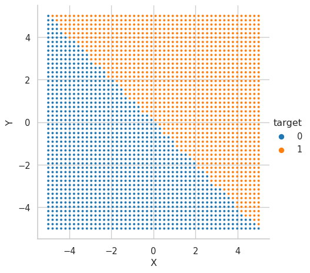
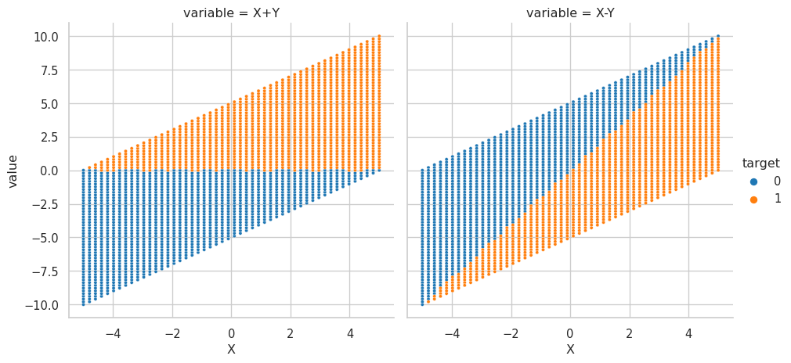
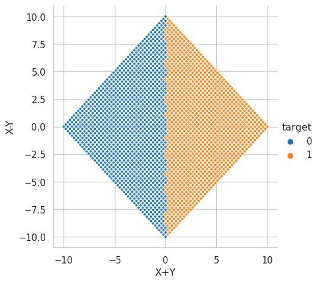
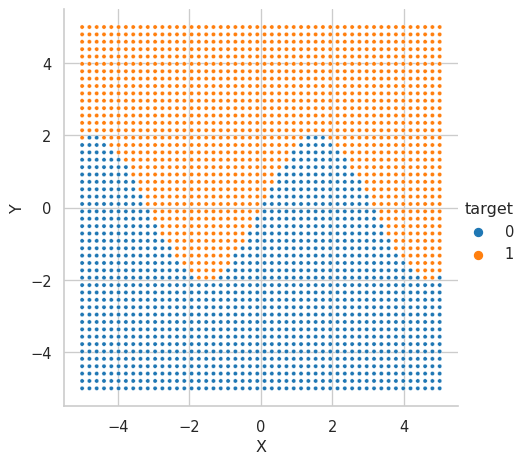
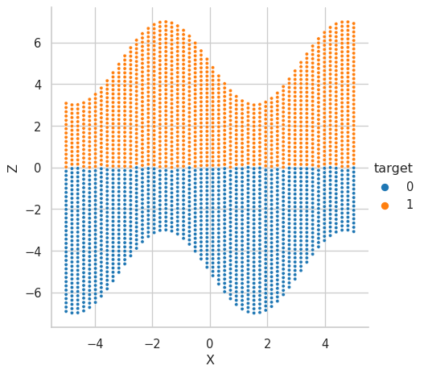

- <a href="#特徴量エンジニアリング"
  id="toc-特徴量エンジニアリング">特徴量エンジニアリング</a>
  - <a href="#数値特徴量の和と差"
    id="toc-数値特徴量の和と差">数値特徴量の和と差</a>
    - <a href="#境界が-y--x-のとき" id="toc-境界が-y--x-のとき">境界が <span
      class="math inline"><em>y</em> =  − <em>x</em></span> のとき</a>
    - <a href="#境界が-y-2-sin-x-のとき"
      id="toc-境界が-y-2-sin-x-のとき">境界が <span
      class="math inline"><em>y</em> = 2sin (<em>x</em>)</span> のとき</a>

# 特徴量エンジニアリング

``` python
import numpy as np
import polars as pl
import seaborn as sns
sns.set_theme(style="whitegrid")
```

## 数値特徴量の和と差

### 境界が $y = -x$ のとき

境界は $y = -x$ つまり、 $y + x = 0$ であるから、 $y + x$
という特徴量を作成することで、 境界が軸に沿うようになり、
決定木での分離が用意になる。 そのことを以下で見ていく。

格子点のデータを作成。 $y = -x$ を境にクラスを分ける。

``` python
x = np.linspace(-5, 5)
y = np.linspace(-5, 5)

x_mesh, y_mesh = np.meshgrid(x, y)

df = pl.DataFrame({
    "X":x_mesh.ravel(),
    "Y":y_mesh.ravel(),
})

df = df.with_column(
    (pl.col("Y") > (- pl.col("X"))).cast(pl.UInt8).alias("target")
)
df.head()
```

    /tmp/ipykernel_7617/451670805.py:11: DeprecationWarning: `with_column` has been deprecated in favor of `with_columns`. This method will be removed in version 0.17.0
      df = df.with_column(

<div>
<style>
.pl-dataframe > thead > tr > th {
  text-align: right;
}
</style>

<table border="1" class="pl-dataframe">
<small>shape: (5, 3)</small>
<thead>
<tr>
<th>
X
</th>
<th>
Y
</th>
<th>
target
</th>
</tr>
<tr>
<td>
f64
</td>
<td>
f64
</td>
<td>
u8
</td>
</tr>
</thead>
<tbody>
<tr>
<td>
-5.0
</td>
<td>
-5.0
</td>
<td>
0
</td>
</tr>
<tr>
<td>
-4.795918
</td>
<td>
-5.0
</td>
<td>
0
</td>
</tr>
<tr>
<td>
-4.591837
</td>
<td>
-5.0
</td>
<td>
0
</td>
</tr>
<tr>
<td>
-4.387755
</td>
<td>
-5.0
</td>
<td>
0
</td>
</tr>
<tr>
<td>
-4.183673
</td>
<td>
-5.0
</td>
<td>
0
</td>
</tr>
</tbody>
</table>
</div>

可視化

<details>
<summary>コード</summary>

``` python
sns.relplot(
    data=df,
    x="X",
    y="Y",
    hue="target",
    palette="tab10",
    s=10,
);
```

</details>

<figure>

<figcaption aria-hidden="true">図 1: <span
class="math inline"><em>y</em> =  − <em>x</em></span>
を境に正解のクラスが変わるデータ。境界が軸に対して斜めであるため、決定木では深さが必要となる。</figcaption>
</figure>

和と差を計算する

``` python
df = df.with_columns([
    (pl.col("X") + pl.col("Y")).alias("X+Y"),
    (pl.col("X") - pl.col("Y")).alias("X-Y"),
])
```

可視化

<details>
<summary>コード</summary>

``` python
sns.relplot(
    data=df.melt(["X", "Y", "target"]),
    x="X",
    y="value",
    col="variable",
    hue="target",
    palette="tab10",
    s=10,
);
```

</details>

<figure>

<figcaption aria-hidden="true">図 2:
左は縦軸を<code>X+Y</code>にしたもの。右は縦軸を<code>X=Y</code>にしたもの。和
<code>X+Y</code> と元の変数 <code>X</code>
の2次元では、境界が軸に沿っているので、深さ1の決定木でほぼ分離できる。差<code>X=Y</code>
と<code>X</code>の2次元では、境界が軸に沿っていないので、決定木の深さが必要となる。</figcaption>
</figure>

<details>
<summary>コード</summary>

``` python
sns.relplot(
    data=df,
    x="X+Y",
    y="X-Y",
    hue="target",
    palette="tab10",
    s=10,
);
```

</details>

<figure>

<figcaption aria-hidden="true">図 3: <code>X+Y</code> と
<code>X-Y</code> の2次元では元の <code>X</code> と <code>Y</code>
のデータを回転（と定数倍）した形になる。境界が軸に沿っているので、深さ1の決定木でほぼ分離できる。</figcaption>
</figure>

### 境界が $y = 2 \sin (x)$ のとき

データ作成

``` python
x = np.linspace(-5, 5)
y = np.linspace(-5, 5)

x_mesh, y_mesh = np.meshgrid(x, y)

df = pl.DataFrame({
    "X":x_mesh.ravel(),
    "Y":y_mesh.ravel(),
})

df = df.with_column(
    (pl.col("Y") > 2 * np.sin(pl.col("X"))).cast(pl.UInt8).alias("target")
)
df.head()
```

    /tmp/ipykernel_7617/352439095.py:11: DeprecationWarning: `with_column` has been deprecated in favor of `with_columns`. This method will be removed in version 0.17.0
      df = df.with_column(

<div>
<style>
.pl-dataframe > thead > tr > th {
  text-align: right;
}
</style>

<table border="1" class="pl-dataframe">
<small>shape: (5, 3)</small>
<thead>
<tr>
<th>
X
</th>
<th>
Y
</th>
<th>
target
</th>
</tr>
<tr>
<td>
f64
</td>
<td>
f64
</td>
<td>
u8
</td>
</tr>
</thead>
<tbody>
<tr>
<td>
-5.0
</td>
<td>
-5.0
</td>
<td>
0
</td>
</tr>
<tr>
<td>
-4.795918
</td>
<td>
-5.0
</td>
<td>
0
</td>
</tr>
<tr>
<td>
-4.591837
</td>
<td>
-5.0
</td>
<td>
0
</td>
</tr>
<tr>
<td>
-4.387755
</td>
<td>
-5.0
</td>
<td>
0
</td>
</tr>
<tr>
<td>
-4.183673
</td>
<td>
-5.0
</td>
<td>
0
</td>
</tr>
</tbody>
</table>
</div>

可視化

<details>
<summary>コード</summary>

``` python
sns.relplot(
    data=df,
    x="X",
    y="Y",
    hue="target",
    palette="tab10",
    s=10,
);
```

</details>

<figure>

<figcaption aria-hidden="true">図 4: <span
class="math inline"><em>y</em> = 2sin (<em>x</em>)</span>
を境に正解のクラスが変わるデータ。</figcaption>
</figure>

特徴量作成

$z = y - 2 \sin(x)$ とする。

``` python
df = df.with_column(
    (pl.col("Y") - 2 * np.sin(pl.col("X"))).alias("Z")
)
df.head()
```

    /tmp/ipykernel_7617/1613510475.py:1: DeprecationWarning: `with_column` has been deprecated in favor of `with_columns`. This method will be removed in version 0.17.0
      df = df.with_column(

<div>
<style>
.pl-dataframe > thead > tr > th {
  text-align: right;
}
</style>

<table border="1" class="pl-dataframe">
<small>shape: (5, 4)</small>
<thead>
<tr>
<th>
X
</th>
<th>
Y
</th>
<th>
target
</th>
<th>
Z
</th>
</tr>
<tr>
<td>
f64
</td>
<td>
f64
</td>
<td>
u8
</td>
<td>
f64
</td>
</tr>
</thead>
<tbody>
<tr>
<td>
-5.0
</td>
<td>
-5.0
</td>
<td>
0
</td>
<td>
-6.917849
</td>
</tr>
<tr>
<td>
-4.795918
</td>
<td>
-5.0
</td>
<td>
0
</td>
<td>
-6.993027
</td>
</tr>
<tr>
<td>
-4.591837
</td>
<td>
-5.0
</td>
<td>
0
</td>
<td>
-6.985485
</td>
</tr>
<tr>
<td>
-4.387755
</td>
<td>
-5.0
</td>
<td>
0
</td>
<td>
-6.895535
</td>
</tr>
<tr>
<td>
-4.183673
</td>
<td>
-5.0
</td>
<td>
0
</td>
<td>
-6.726911
</td>
</tr>
</tbody>
</table>
</div>
<details>
<summary>コード</summary>

``` python
sns.relplot(
    data=df,
    x="X",
    y="Z",
    hue="target",
    palette="tab10",
    s=10,
);
```

</details>

<figure>

<figcaption aria-hidden="true">図 5: <span
class="math inline"><em>z</em> = <em>y</em> − 2sin (<em>x</em>)</span>
を特徴量として作成することで、境界が軸に沿うようになった。</figcaption>
</figure>
